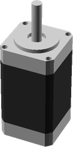
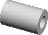
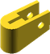
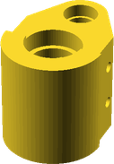
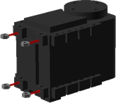
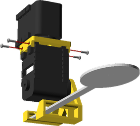
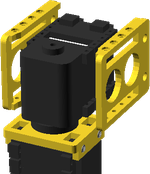
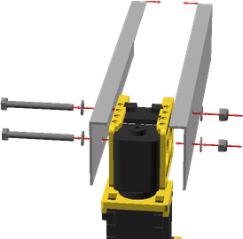

# AFRo
# Assembly Guide

## Bill of Materials

Make sure you have all of the following parts before you begin.

### Vitamins

Qty | Vitamin | Image
--- | --- | ---
2 | [Dynamixel AX12]() |  | 
1 | [NEMA11 Stepper Motor]() |  | 
2 | [NEMA17 Stepper Motor]() |  | 
1 | [Spoon]() |  | 
1 | [Aluminium Angle 10x10x1mm x 420mm]() |  | 
4 | [Aluminium Angle 10x40x1.5mm x 200mm]() |  | 
2 | [Aluminium Angle 10x40x1.5mm x 250mm]() |  | 
2 | [Ball Bearing 608]() |  | 
2 | [Ball Bearing 6205_2RS]() |  | 
4 | [Ball Bearing 624]() |  | 
1 | [Belt T2p5x6 960mm]() |  | 
1 | [Belt T2p5x6 673mm]() |  | 
1 | [LM20UU Linear Bearing]() |  | 
1 | [LM8UU Linear Bearing]() |  | 
1 | [T2.5x18 Pulley]() |  | 
4 | [M2 Nut]() |  | 
5 | [Nyloc M4 Nut]() |  | 
2 | [M6 Nut]() |  | 
1 | [Nyloc M6 Nut]() |  | 
12 | [M2 pan screw x 6mm]() |  | 
2 | [M4 cap screw x 20mm]() |  | 
1 | [M4 hex screw x 30mm]() |  | 
2 | [M4 hex screw x 40mm]() |  | 
16 | [M4 Washer 9x0.8]() |  | 
2 | [M5 Washer 20x1.4]() |  | 
3 | [M8 Washer 17x1.8]() |  | 

### Cut Parts

Qty | Part Name | Image
--- | --- | ---
2 | Lower Arm Left Side |  | 

### Printed Parts

Qty | Part Name | Image
--- | --- | ---
1 | [Base Bracket](../printedparts/stl/BaseBracket.stl) |  | 
1 | [Counterweight Bracket](../printedparts/stl/CounterweightBracket.stl) |  | 
2 | [Counterweight Idler Guide](../printedparts/stl/CounterweightIdlerGuide.stl) |  | 
2 | [Counterweight Idler](../printedparts/stl/CounterweightIdler.stl) |  | 
1 | [Counterweight Line Bracket](../printedparts/stl/CounterweightLineBracket.stl) |  | 
1 | [Elbow Drive Pulley](../printedparts/stl/ElbowDrivePulley.stl) |  | 
1 | [Elbow Driven Pulley](../printedparts/stl/ElbowDrivenPulley.stl) |  | 
1 | [Elbow Joint 2](../printedparts/stl/ElbowJoint2.stl) |  | 
1 | [Elbow Joint](../printedparts/stl/ElbowJoint.stl) |  | 
1 | [Elbow Motor Plate](../printedparts/stl/ElbowMotorPlate.stl) |  | 
2 | [Lower Arm Servo Bracket](../printedparts/stl/LowerArmServoBracket.stl) |  | 
1 | [Shoulder Belt Clamp](../printedparts/stl/ShoulderBeltClamp.stl) |  | 
1 | [Shoulder Bracket Left](../printedparts/stl/ShoulderBracketLeft.stl) |  | 
1 | [Shoulder Bracket Right](../printedparts/stl/ShoulderBracketRight.stl) |  | 
1 | [Spoon Holder](../printedparts/stl/SpoonHolder.stl) |  | 
1 | [Torso Base](../printedparts/stl/TorsoBase.stl) |  | 
1 | [Torso Bearing Collar](../printedparts/stl/TorsoBearingCollar.stl) |  | 
1 | [Torso Bearing Top Collar](../printedparts/stl/TorsoBearingTopCollar.stl) |  | 
1 | [Torso Big Gear](../printedparts/stl/TorsoBigGear.stl) |  | 
1 | [Torso Cap](../printedparts/stl/TorsoCap.stl) |  | 
1 | [Torso Drive Gear](../printedparts/stl/TorsoDriveGear.stl) |  | 
1 | [Wrist Bracket](../printedparts/stl/WristBracket.stl) |  | 

# Cutting Instructions

## Lower Arm Left Side (x2)

### Vitamins

Qty | Vitamin | Image
--- | --- | ---
4 | [Aluminium Angle 10x40x1.5mm x 200mm]() |  | 

### Fabrication Steps

1. Cut aluminium angle to 200mm

2. Drill 4mm diameter fixing holes

# Assembly Instructions

## Spoon

### Vitamins

Qty | Vitamin | Image
--- | --- | ---
1 | [Dynamixel AX12]() |  | 
1 | [Spoon]() |  | 
4 | [M2 Nut]() |  | 
4 | [M2 pan screw x 6mm]() |  | 

### Printed Parts

Qty | Part Name | Image
--- | --- | ---
1 | [Spoon Holder](../printedparts/stl/SpoonHolder.stl) |  | 

### Assembly Steps

1. Push M2 nuts into the back of the servo fixing tabs

2. Attach the spoon holder to the servo

## Hand

### Vitamins

Qty | Vitamin | Image
--- | --- | ---
1 | [Dynamixel AX12]() |  | 
8 | [M2 pan screw x 6mm]() |  | 

### Printed Parts

Qty | Part Name | Image
--- | --- | ---
1 | [Wrist Bracket](../printedparts/stl/WristBracket.stl) |  | 

### Sub-Assemblies

Qty | Name 
--- | --- 
1 | Spoon

### Assembly Steps

1. Screw the wrist bracket onto the wrist servo

2. Push the spoon assembly into the wrist bracket

3. Screw through the bracket into the servo fixings

## Elbow Joint

### Vitamins

Qty | Vitamin | Image
--- | --- | ---
2 | [Ball Bearing 608]() |  | 
1 | [Belt T2p5x6 673mm]() |  | 
2 | [M6 Nut]() |  | 
1 | [Nyloc M6 Nut]() |  | 
3 | [M8 Washer 17x1.8]() |  | 

### Printed Parts

Qty | Part Name | Image
--- | --- | ---
1 | [Elbow Driven Pulley](../printedparts/stl/ElbowDrivenPulley.stl) |  | 
1 | [Elbow Joint](../printedparts/stl/ElbowJoint.stl) |  | 

## Lower Arm

### Vitamins

Qty | Vitamin | Image
--- | --- | ---
2 | [Nyloc M4 Nut]() |  | 
2 | [M4 hex screw x 40mm]() |  | 
4 | [M4 Washer 9x0.8]() |  | 

### Printed Parts

Qty | Part Name | Image
--- | --- | ---
1 | [Elbow Joint 2](../printedparts/stl/ElbowJoint2.stl) |  | 
2 | [Lower Arm Servo Bracket](../printedparts/stl/LowerArmServoBracket.stl) |  | 

### Sub-Assemblies

Qty | Name 
--- | --- 
1 | Hand

### Assembly Steps

1. Push the servo brackets onto the servo, optionally screw them into place

2. Bolt through the aluminium channels and servo brackets

3. Bolt through the aluminium channels and elbow joint

## Counterweight Idler (x2)

### Vitamins

Qty | Vitamin | Image
--- | --- | ---
2 | [Ball Bearing 624]() |  | 
2 | [Nyloc M4 Nut]() |  | 
2 | [M4 cap screw x 20mm]() |  | 
8 | [M4 Washer 9x0.8]() |  | 

### Printed Parts

Qty | Part Name | Image
--- | --- | ---
2 | [Counterweight Idler Guide](../printedparts/stl/CounterweightIdlerGuide.stl) |  | 
2 | [Counterweight Idler](../printedparts/stl/CounterweightIdler.stl) |  | 

## Shoulder

### Vitamins

Qty | Vitamin | Image
--- | --- | ---
1 | [NEMA11 Stepper Motor]() |  | 
2 | [Aluminium Angle 10x40x1.5mm x 250mm]() |  | 
1 | [LM20UU Linear Bearing]() |  | 
1 | [LM8UU Linear Bearing]() |  | 

### Printed Parts

Qty | Part Name | Image
--- | --- | ---
1 | [Counterweight Line Bracket](../printedparts/stl/CounterweightLineBracket.stl) |  | 
1 | [Elbow Drive Pulley](../printedparts/stl/ElbowDrivePulley.stl) |  | 
1 | [Elbow Motor Plate](../printedparts/stl/ElbowMotorPlate.stl) |  | 
1 | [Shoulder Belt Clamp](../printedparts/stl/ShoulderBeltClamp.stl) |  | 
1 | [Shoulder Bracket Left](../printedparts/stl/ShoulderBracketLeft.stl) |  | 
1 | [Shoulder Bracket Right](../printedparts/stl/ShoulderBracketRight.stl) |  | 

### Sub-Assemblies

Qty | Name 
--- | --- 
1 | Elbow Joint
1 | Lower Arm

## Counterweight

### Printed Parts

Qty | Part Name | Image
--- | --- | ---
1 | [Counterweight Bracket](../printedparts/stl/CounterweightBracket.stl) |  | 

## Cable Guide

### Vitamins

Qty | Vitamin | Image
--- | --- | ---
1 | [Aluminium Angle 10x10x1mm x 420mm]() |  | 

## Torso

### Vitamins

Qty | Vitamin | Image
--- | --- | ---
1 | [NEMA17 Stepper Motor]() |  | 
2 | [Ball Bearing 6205_2RS]() |  | 
2 | [Ball Bearing 624]() |  | 
1 | [Belt T2p5x6 960mm]() |  | 
1 | [T2.5x18 Pulley]() |  | 
1 | [Nyloc M4 Nut]() |  | 
1 | [M4 hex screw x 30mm]() |  | 
4 | [M4 Washer 9x0.8]() |  | 
2 | [M5 Washer 20x1.4]() |  | 

### Printed Parts

Qty | Part Name | Image
--- | --- | ---
1 | [Torso Base](../printedparts/stl/TorsoBase.stl) |  | 
1 | [Torso Bearing Collar](../printedparts/stl/TorsoBearingCollar.stl) |  | 
1 | [Torso Bearing Top Collar](../printedparts/stl/TorsoBearingTopCollar.stl) |  | 
1 | [Torso Big Gear](../printedparts/stl/TorsoBigGear.stl) |  | 
1 | [Torso Cap](../printedparts/stl/TorsoCap.stl) |  | 

### Sub-Assemblies

Qty | Name 
--- | --- 
2 | Counterweight Idler
1 | Shoulder
1 | Counterweight
1 | Cable Guide

## Torso Drive

### Vitamins

Qty | Vitamin | Image
--- | --- | ---
1 | [NEMA17 Stepper Motor]() |  | 

### Printed Parts

Qty | Part Name | Image
--- | --- | ---
1 | [Torso Drive Gear](../printedparts/stl/TorsoDriveGear.stl) |  | 

## AFRo

### Printed Parts

Qty | Part Name | Image
--- | --- | ---
1 | [Base Bracket](../printedparts/stl/BaseBracket.stl) |  | 

### Sub-Assemblies

Qty | Name 
--- | --- 
1 | Torso
1 | Torso Drive

